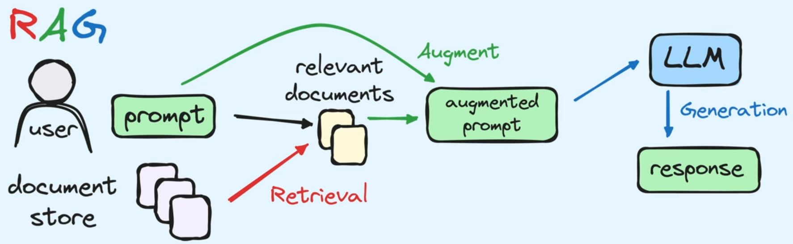

- [Estrategias de RAG y evaluación de preguntas en modelos de lenguaje](#estrategias-de-rag-y-evaluación-de-preguntas-en-modelos-de-lenguaje)
    - [FAMaFyC, Universidad Nacional de Córdoba, Argentina](#famafyc-universidad-nacional-de-córdoba-argentina)
    - [Autores](#autores)
    - [Fecha](#fecha)
  - [Resumen](#resumen)
  - [1. Introducción](#1-introducción)
  - [2. Retrieval Augmented Generation](#2-retrieval-augmented-generation)
  - [3. Marco de trabajo](#3-marco-de-trabajo)
    - [3.1. Metodología](#31-metodología)
    - [3.2. Contextos seleccionados](#32-contextos-seleccionados)
      - [3.2.1. *Cheatsheet* de Git](#321-cheatsheet-de-git)
      - [3.2.2. Guion de una película](#322-guion-de-una-película)
      - [3.2.3. Letras de canciones](#323-letras-de-canciones)
    - [3.3. Desarrollo del enfoque RAG](#33-desarrollo-del-enfoque-rag)
    - [3.4. Herramientas utilizadas](#34-herramientas-utilizadas)
    - [3.5. Repositorio del proyecto](#35-repositorio-del-proyecto)
  - [4. Resultados obtenidos](#4-resultados-obtenidos)
    - [4.1. Respuestas contextuales satisfactorias](#41-respuestas-contextuales-satisfactorias)
    - [4.2. Respuestas contextuales no satisfactorias](#42-respuestas-contextuales-no-satisfactorias)
    - [4.3. Respuestas no contextuales](#43-respuestas-no-contextuales)
  - [5. Conclusiones](#5-conclusiones)
  - [Referencias](#referencias)

---

# Estrategias de RAG y evaluación de preguntas en modelos de lenguaje

### FAMaFyC, Universidad Nacional de Córdoba, Argentina

### Autores

- Felipe Clariá Dambolena ([felipe.claria@unc.edu.ar](mailto:felipe.claria@unc.edu.ar))
- Santiago Joaquín Fada ([santiago.fada@mi.unc.edu.ar](mailto:santiago.fada@mi.unc.edu.ar))

### Fecha

Diciembre de 2024

## Resumen

 El uso de Retrieval Augmented Generation (RAG) ha ganado popularidad como una técnica para mejorar la generación de respuestas en los grandes modelos de lenguaje, especialmente en tareas que requieren contextualización. Esta metodología permite integrar información externa al modelo, proporcionando un marco de referencia que enriquece el contenido de las respuestas generadas. En este estudio, exploramos cómo RAG puede optimizar la respuesta a preguntas complejas y especializadas, abordando tanto consultas ambiguas como altamente técnicas. Además, evaluamos su capacidad para manejar información contradictoria o incompleta, lo que es crucial para mejorar la calidad de las interacciones y la confianza en las respuestas de los modelos de lenguaje.

## 1. Introducción

Los Large Language Models (LLMs) se han consolidado como herramientas de gran utilidad para el desarrollo de tareas de procesamiento de texto, incluyendo la generación automática de contenido, la traducción de idiomas, el análisis de sentimientos, y la extracción de información relevante [[1]](#referencias). A pesar de esto, presentan limitaciones significativas al enfrentarse a ciertas consultas que requieren de información actualizada o del conocimiento específico de un dominio que se escapa de los datos de entrenamiento del modelo. Estas restricciones suelen manifestarse en forma de *alucinaciones* generativas, donde los modelos efectivamente producen respuestas, pero son incorrectas o inventadas, lo que no solo reduce su calidad, sino también su confiabilidad en contextos exigentes.

El enfoque de RAG ha surgido como una respuesta a estas limitaciones. Al introducir la recuperación de información relevante previa a la generación del texto, la estrategia de RAG tiene el potencial de proporcionar respuestas más precisas, contextualizadas y adaptadas a las necesidades específicas del usuario [[2]](#referencias).

Este proyecto tiene como objetivos la identificación y el análisis de contextos en los cuales el enfoque RAG ofrece ventajas significativas sobre el uso tradicional de los LLMs. En particular, buscamos determinar y categorizar los tipos de preguntas en los que esta técnica produce respuestas más precisas y relevantes según el contexto específico.

## 2. Retrieval Augmented Generation

Las técnicas de generación mejorada por recuperación (RAG) abordan las limitaciones de los LLMs mediante la incorporación de un paso previo a la generación del texto: la recuperación de información externa. Esta estrategia consiste de tres fases principales:

- **R**etrieval (*Recuperación de información*):
  Utiliza un motor de búsqueda para identificar y recuperar documentos o fragmentos de texto relevantes desde un corpus predefinido. Estos datos proporcionan un contexto adicional basado en información específica.

- **A**ugmented (*Enriquecimiento del contexto*):
  Los fragmentos de texto recuperados se integran con el *prompt* original para formar una consulta ampliada. Este paso permite presentar la información adicional de manera estructurada y comprensible para el LLM, mejorando la calidad de la generación posterior.

- **G**eneration (*Generación de texto*):
  Finalmente, el modelo utiliza la consulta enriquecida de contexto para generar una respuesta.

**Figura 1.1: Enfoque tradicional de preguntas a un LLM**

**Figura 1.2: Enfoque de preguntas a un LLM utilizando RAG**

## 3. Marco de trabajo

### 3.1. Metodología

Para evaluar el desempeño del enfoque RAG, se siguió una metodología estructurada en tres etapas:

- **Selección de contextos:**
  Se selecciona un conjunto de documentos en formato PDF que constituyen distintos **contextos** específicos. Estos contextos luego son utilizados como fuentes de información para enriquecer las consultas al modelo, por lo que deben ser diversos para lograr una mayor cobertura sobre los tipos de preguntas planteadas y en la calidad de respuestas generadas.

- **Definición de preguntas:**
  Para cada uno de los contextos elegidos, se diseña una serie de preguntas relacionadas a la información contenida en el mismo. Estas preguntas luego serán consultadas al modelo para medir su efectividad en los respectivos contextos.

  Para abarcar distintos niveles de complejidad, se definió la siguiente tipificación de las preguntas:

    1. **Preguntas de contexto cerrado:** Resueltas dentro del conocimiento del modelo, para las cuales creemos el uso de RAG no daría una mejora significativa.
    2. **Preguntas contextuales:** Requieren información adicional no contenida en el modelo.
    3. **Preguntas ambiguas o complejas:** No pueden ser resueltas adecuadamente con o sin información adicional debido a la ambigüedad de las propias preguntas o respuestas.
    4. **Preguntas especializadas:** Implican la necesidad de información filtrada o criterios específicos.

- **Generación y evaluación de respuestas:** Se utilizan las preguntas definidas en la etapa previa para realizar consultas al modelo bajo dos escenarios:

  - cuando se proporciona el contexto asociado (metodología RAG), y
  - cuando no se proporciona ningún contexto (modelo tradicional).

  Luego, se evalúa la calidad y la relevancia de las respuestas generadas en cada uno de estos escenarios, y se comparan los resultados en busca de patrones que determinen qué casos presentan mejoras en la utilización de RAG frente a los LLMs tradicionales.

### 3.2. Contextos seleccionados

En la primera etapa de la experimentación, seleccionamos tres contextos específicos diseñados para cubrir una amplia variedad de tipos de preguntas:

#### 3.2.1. *Cheatsheet* de Git

El primer contexto evaluado utiliza los primeros diez capítulos del documento *Git Notes for Professionals* de GoalKicker.com [[3]](#referencias). Consiste en una recopilación de comandos y buenas prácticas relacionadas con el uso de la herramienta Git para el control y versionado de código. Este material es de libre acceso y está verificado por desarrolladores.

El objetivo de este contexto fue evaluar cómo RAG puede manejar un dominio técnico con alta exigencia en precisión y relevancia. Esto incluye determinar si el modelo es capaz de extraer correctamente los comandos o métodos detallados en el documento, así como la calidad de la respuesta cuando no se proporciona el contexto. No obstante, sabemos que este es un contexto en el cual ya existe una abundante cantidad de información difundida, lo que podría influir en la capacidad del modelo para responder incluso sin acceso al documento específico.

Teniendo en cuenta estos aspectos, se plantearon dos tipos principales de preguntas:

  - **Preguntas de contexto cerrado:**
  Diseñadas para evaluar comandos ampliamente difundidos, que no requieren contexto adicional para ser respondidas.

  - **Preguntas especializadas:**
  Exploran comandos avanzados o flujos específicos en Git, y que requieren un conocimiento detallado del material proporcionado.

#### 3.2.2. Guion de una película

El segundo contexto evaluado utiliza el guion de la película *Gato con botas: El último deseo* (2022) [[4]](#referencias). Este material contiene tanto los diálogos de la película así como información detallada sobre la historia, los personajes y los escenarios presentados en el largometraje.

Este título está inspirado en el personaje clásico del gato con botas, extensivamente referenciado en la literatura y en la cultura popular, por lo que constituye un contexto particularmente interesante para analizar cómo la técnica RAG maneja información contradictoria o irrelevante. Además, se eligió también con el objetivo de evaluar la capacidad del modelo mejorado para responder preguntas con distintos niveles de ambigüedad y dependencia del contexto.

Se plantearon, entonces, los siguientes tipos principales de preguntas:

  - **Preguntas contexto cerrado:**
  Preguntas cuya respuesta no requiere necesariamente del contexto del guion, ya que la información está ampliamente difundida y puede presentar contradicciones.

  - **Preguntas contextuales:**
  Exploran detalles específicos de la historia, los personajes y los escenarios de la película.

  - **Preguntas ambiguas:**
  Diseñadas para abordar temas como el mensaje de la película, que pueden ser interpretados de múltiples maneras.

#### 3.2.3. Letras de canciones

El tercer contexto elegido utiliza las letras de canciones de la banda *SUMO*. Este material incluye las letras completas obtenidas mediante técnicas de *web scrapping*, lo que permitió analizar la discografía completa de la banda y plantear preguntas en torno a la interpretación de sus canciones.

Debido a la naturaleza subjetiva de las letras y a las posibles imprecisiones del *scrapping*, este contexto introdujo desafíos adicionales en la evaluación de respuestas. Con este contexto, se buscó evaluar la capacidad del modelo para responder preguntas de distinta complejidad, desde análisis subjetivos sobre el significado de las canciones, hasta consultas sobre información específica de las mismas.

Dentro de este contexto, se plantearon los siguientes tipos de preguntas:

  - **Preguntas ambiguas:**
  Relacionadas a la interpretación del significado de las canciones y la relación que guardan con el contexto cultural de la banda. Las respuestas a estas preguntas son subjetivas, y pueden resultar difíciles de responder hasta por un ser humano.

  - **Preguntas especializadas:**
  Diseñadas para indagar sobre versos particulares o elementos destacados en canciones puntuales.

  - **Preguntas contextuales básicas:**
  Cuestionamientos simples sobre información explícita que puede encontrarse directamente en las letras de las canciones.

### 3.3. Desarrollo del enfoque RAG

Para implementar el enfoque RAG, el documento asociado a cada contexto es fragmentado en sus distintas paginas. Cada una de estas páginas es entonces codificada en forma de *embedding* vectorial, una representación numérica de alta dimensionalidad que captura las relaciones semánticas del contenido textual [[5]](#referencias). Los *embeddings* generados permiten proyectar el contenido en un espacio vectorial, facilitando operaciones matemáticas para comparar similitudes.

Cuando un usuario realiza una consulta, la pregunta se codifica también como un vector. A continuación, se buscan en el espacio vectorial los vectores más próximos al de la consulta, utilizando métricas como la similitud coseno. De estos resultados, se seleccionan los cinco vectores más cercanos, extrayendo sus fragmentos de texto correspondientes.

Estos fragmentos recuperados se combinan con la pregunta original para construir una consulta enriquecida. Esta consulta es enviada al modelo junto con una instrucción clara: responder a la pregunta planteada basándose *únicamente* en el contexto proporcionado y, en caso de no encontrar información suficiente, responder "No lo sé".

### 3.4. Herramientas utilizadas

La implementación del experimento fue realizada en lenguaje Python, haciendo uso de *notebooks* de Jupyter. Además, se utilizó un conjunto de librerías y tecnologías especializadas para facilitar la construcción y comunicación con LLMs. Estas herramientas fueron elegidas en función de nuestra experiencia previa, priorizando la libertad de su acceso así como la disponibilidad de los recursos y de la documentación. En orden, las tecnologías utilizadas son:

  - **Llama 2:** [[6]](#referencias)
  Modelo de lenguaje base, utilizado tanto para la generación de texto como para el cálculo de *embeddings*. Debido a que este modelo presenta un sesgo notable hacia el idioma inglés, las consultas realizadas fueron formuladas exclusivamente en ese idioma con el objetivo de no introducir una nueva fuente de error a la hora de generar las respuestas.
  Por otra parte, la propia modularización del código hizo posible que cambiar el modelo del lenguaje impacte poco en la estructura del mismo, facilitando la utilización de algún otro modelo, si se desea.

  - **LangChain:** [[7]](#referencias)
  Herramienta utilizada para la construcción de *pipelines* que facilitan la gestión eficiente del flujo de información entre las distintas etapas involucradas en los procesos de recuperación de contexto y de generación de respuestas por parte del modelo.

  - **Pinecone:** [[8, 9]](#referencias)
  Espacio vectorial empleado como base de datos para almacenar los *embeddings* generados a partir de los documentos seleccionados. Para este trabajo nos limitamos a la versión gratuita de la herramienta, puesto que las limitaciones que esta nos impone no fueron un inconveniente a la hora de realizar los experimentos.

### 3.5. Repositorio del proyecto

El desarrollo de este proyecto se encuentra respaldado por un repositorio de código públicamente accesible en la plataforma GitHub: https://github.com/feliclaria/rag. Este repositorio fue diseñado para proporcionar una visión integral del trabajo realizado y facilitar su reproducción o extensión por parte de la comunidad.

En el repositorio se incluyen los siguientes directorios y archivos de importancia:

- **`pdfs`:** Directorio con los archivos PDF que se emplearon para definir los contextos y generar las preguntas correspondientes.
- **`questions`:** Directorio con archivos TXT que contienen las preguntas planteadas, separadas por contexto.
- **`lyric_scrapper.py`:** Código utilizado para extraer las letras de canciones de la banda Sumo desde internet, y confeccionar un documento listando todas las canciones.
- **`main.ipynb`:** El conjunto de herramientas y bibliotecas empleadas para implementar el enfoque RAG, incluyendo los procesos de fragmentación de documentos, generación de *embeddings*, almacenamiento en espacios vectoriales y consultas al LLM.
- **`results.csv`:** Un CSV que contiene los resultados obtenidos durante las pruebas.

## 4. Resultados obtenidos

Las respuestas generadas por el modelo mostraron distintos patrones al comparar la calidad de las respuestas al utilizar RAG y al usar el enfoque tradicional. Estos resultados se agruparon en cuatro categorías principales para su análisis, descritos a continuación.

### 4.1. Respuestas contextuales satisfactorias

Para gran parte de las preguntas planteadas, el modelo pudo utilizar la información proporcionada por el contexto para generar una respuesta correcta. Esto se vio reflejado en una mejora notable en las respuestas generadas con consultas enriquecidas.

Un ejemplo concreto en donde el modelo con RAG presentó mejoras de calidad fue con la pregunta "¿Cómo se llaman los personajes principales?". Sin contexto, el modelo tradicional respondió listando los personajes del libro *Alicia en el País de las Maravillas* de Lewis Carroll. Al proporcionar el guion de la película del Gato con Botas, en cambio, el modelo pudo responder correctamente con los nombres de los protagonistas del título.

Otro caso de estudio fue también el de preguntas cuyas respuestas no se encontraban en el contexto brindado. Por ejemplo, al preguntar "¿Quién es el padre de Luke?", el LLM tradicional infiere que hace referencia a la saga de películas *Star Wars*, produciendo entonces una respuesta acorde a ese contexto: "El padre de Luke Skywalker es Anakin Skywalker". En cambio, al incorporar el contexto de la documentación de Git en la consulta, el modelo responde de manera satisfactoria explicando que no posee la información necesaria para contestar adecuadamente.

Las respuestas de este tipo fueron transversales a la tipificación de las preguntas, con resultados similares encontrados para cada contexto establecido.

### 4.2. Respuestas contextuales no satisfactorias

Un patrón común que se encontró en varias de los resultados fue que al introducir un contexto específico las respuestas del modelo presentaron incertidumbres, que en algunos casos llegaron a empeorar la calidad de las respuestas. Es decir, que si bien el modelo pudo responder usando información del contexto provisto, la salida generada no contesta adecuadamente a la pregunta realizada.

Para algunas de las preguntas, esto se manifestó con respuestas que dan información correcta pero que no hace alusión a la pregunta establecida. Este caso se dio, por ejemplo, cuando se usó como contexto a las letras de las canciones de Sumo: al consultar sobre el mensaje de la canción número 30 de la lista, el modelo pudo generar una interpretación del mensaje de una de las canciones, pero no de la solicitada.

En otros casos, en cambio, las respuestas generadas fueron correctas pero solo parcialmente. Volviendo a las canciones de Sumo, al solicitar los nombres de diez canciones de la lista el modelo pudo responder con un listado donde solo las primeras cinco entradas correspondían a canciones presentes en la lista original, mientras que el resto de las canciones mencionadas eran títulos inventados a partir de los versos de las canciones listadas previamente.

Este tipo de respuestas se encontró en preguntas variadas, ya sean contextuales simples o complejas, en donde el modelo sin contexto directamente no puede responder correctamente a la pregunta. Sin embargo, los casos en los que este fenómeno fue más notorio fue para las preguntas de contexto cerrado, ya que la respuesta del LLM tradicional, sin la información mejorada del contexto, resultaba en respuestas más precisas que las del modelo contextualizado.

No atribuimos este problema al modelo elegido, sino al proceso de recuperación de datos, que pudo verse influenciado tanto por el formato en la que se codificó la información, como por el método de contextualización implementado.

### 4.3. Respuestas no contextuales

Por último, se presentaron algunos casos minoritarios en donde el uso de RAG no presento cambios significativos con respecto al modelo tradicional. Para estos escenarios, los dos enfoques respondieron con el mismo nivel de correctitud a las preguntas, y a veces dando la misma respuesta.

Este caso se dio principalmente con las preguntas de contexto cerrado, donde el modelo ya era capaz de responder satisfactoriamente sin necesidad de una fuente externa. También, se encontraron resultados similares en las preguntas especializadas, en las cuales el contexto no bastó para poder dar una respuesta lo suficientemente precisa. Ambos casos se vieron evidenciados principalmente por las preguntas asociadas a la documentación de Git, debido a la naturaleza técnica y limitante del conocimiento requerido.

## 5. Conclusiones

A partir de los resultados obtenidos y de los casos analizados, pudimos concluir lo siguiente con respecto a la comparación de los enfoques planteados:

- **Mejora con contexto:**
  Las respuestas generadas por el modelo mejoran cuando se proporciona un contexto adecuado, mostrando una mayor calidad y relevancia en comparación con las respuestas sin contexto adicional. Esta mejora no se da de manera uniforme, sino que es mas notoria para las preguntas que dependen del contexto, pero sin ser tan específicas. Por otro lado, no hay una diferencia significativa para preguntas muy especializadas o para preguntas que ya se podían responder naturalmente con el modelo tradicional.

- **Orientación de las respuestas:**
  Si bien la incorporación del contexto no siempre permite que el modelo responda con la información textual proporcionada, cuando este se usa de manera adecuada actúa como una guía que ayuda al modelo a generar respuestas más alineadas con el resultado esperado.

- **Importancia del método de recuperación:**
  El mecanismo utilizado para recuperar datos del contexto seleccionado tiene un impacto directo y muy notorio en la calidad de las respuestas, destacando la necesidad de un enfoque cuidadoso en esta etapa para maximizar el desempeño del modelo.

## Referencias

1. Nikhil Kandpal et al. *Large Language Models Struggle to Learn Long-Tail Knowledge.* 2023. arXiv: [2211.08411 [cs.CL]](https://arxiv.org/abs/2211.08411). URL: https://arxiv.org/abs/2211.08411.

2. Yunfan Gao et al. *Retrieval-Augmented Generation for Large Language Models: A Survey.* 2024. arXiv: [2312.10997 [cs.CL]](https://arxiv.org/abs/2312.10997). URL: https://arxiv.org/abs/2312.10997.

3. *Git Notes for Professionals.* https://goalkicker.com/GitBook/GitNotesForProfessionals.pdf. 2018. (Visitado 22-12-2024).

4. Joel Crawford y Januel Mercado. *Puss in Boots: The Last Wish.* 2022. URL: https://www.imdb.com/title/tt3915174/ (visitado 22-12-2024).

5. Pinecone. *What is a Vector Database & How Does it Work? Use Cases + Examples.* 2024. URL: https://www.pinecone.io/learn/vector-database/ (visitado 22-12-2024).

6. Hugo Touvron et al. *Llama 2: Open Foundation and Fine-Tuned Chat Models.* 2023. arXiv: [2307.09288 [cs.CL]](https://arxiv.org/abs/2307.09288). URL: https://arxiv.org/abs/2307.09288.

7. Oguzhan Topsakal y T. Cetin Akinci. *"Creating Large Language Model Applications Utilizing LangChain: A Primer on Developing LLM Apps Fast".* En: *International Conference on Applied Engineering and Natural Sciences* 11 (jul. de 2023), págs. 1050-1056. DOI: [10.59287/icaens.1127](https://doi.org/10.59287/icaens.1127).

8. Xingrui Xie et al. *"A Brief Survey of Vector Databases".* En: *2023 9th International Conference on Big Data and Information Analytics (BigDIA)*. 2023, págs. 364-371. DOI: [10.1109/BigDIA60676.2023.10429609](https://doi.org/10.1109/BigDIA60676.2023.10429609).

9. Pinecone. *The vector database to build knowledgeable AI.* 2024. URL: https://www.pinecone.io/ (visitado 22-12-2024).
